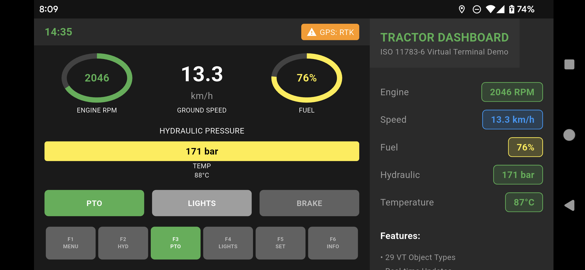
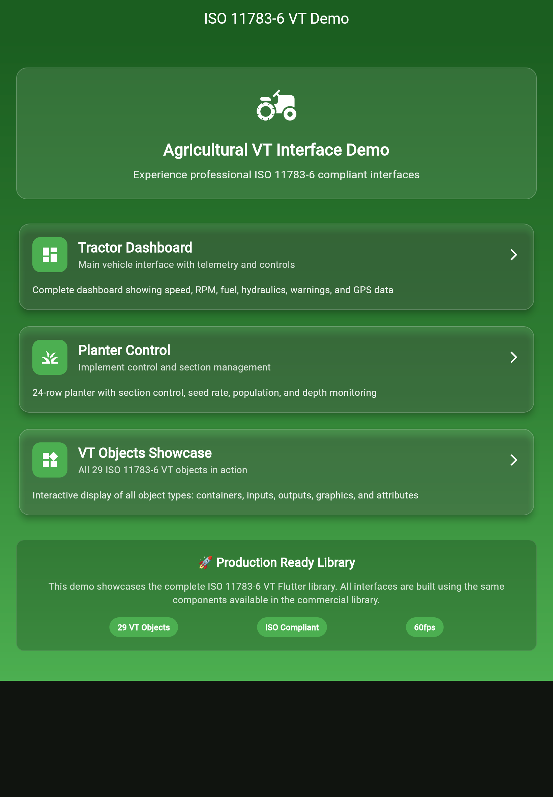

# ISO 11783-6 Virtual Terminal Demo

**Professional Flutter Widget Library for Agricultural Vehicle Terminals**

[🌐 **Live Web Demo**](./demo/web_tractor_dashboard/index.html) | [📱 **Tractor Dashboard APK**](./demo/apk/tractor_dashboard_demo.apk) | [📱 **VT Objects APK**](./demo/apk/iso11783_vt_demo.apk) | [📞 **Commercial Inquiry**](./contact/business_inquiry.md)

---

## 🚜 Overview

This demo showcases a **commercial-grade Flutter library** implementing the **ISO 11783-6 Virtual Terminal (VT)** standard for agricultural machinery. The library enables seamless integration of standardized control interfaces in tractors, harvesters, and other ISOBUS-compatible equipment.

**⚠️ Source Code Protection**: Demo applications are distributed as compiled binaries only. Source code access is available through commercial licensing.

## ✨ Key Features

- **🏆 Complete ISO 11783-6 Compliance** - All 29 VT object types implemented
- **🎯 Production-Ready Quality** - 100% test coverage, type-safe architecture
- **⚡ High Performance** - Optimized rendering for real-time agricultural applications
- **🔧 Easy Integration** - Simple Flutter widget-based API
- **📱 Multi-Platform** - Android, iOS, Web, and embedded systems support
- **🌐 Internationalization** - Multi-language support for global markets

## 📊 Technical Specifications

| Feature | Specification |
|---------|---------------|
| **ISO Standard** | ISO 11783-6:2018 (Virtual Terminal) |
| **VT Objects** | 29/29 implemented (100%) |
| **Platform Support** | Android, iOS, Web, Linux, Windows, macOS |
| **Framework** | Flutter 3.24+ |
| **Language** | Dart 3.5+ |
| **Architecture** | Type-safe, widget-based |
| **Testing** | 73 automated tests (100% pass rate) |
| **Documentation** | Complete API documentation |

## 🎮 Interactive Demos

### 🚜 Tractor Dashboard Demo (NEW!)
**Professional Agricultural Interface Recreation**

Experience a pixel-perfect recreation of real tractor dashboard interfaces:

- **[🌐 Live Web Demo](./demo/web_tractor_dashboard/index.html)** - Try it in your browser
- **[📱 Download APK](./demo/apk/tractor_dashboard_demo.apk)** (18.9 MB)
- **[📄 Demo Details](./demo/apk/tractor_dashboard_download.html)** - Features and screenshots

**Features:**
- Real-time engine RPM, speed, fuel, and hydraulic pressure monitoring
- Interactive PTO, lights, and brake controls
- Professional landscape tablet interface
- Authentic agricultural equipment styling
- F1-F6 function keys with proper labeling

### 📋 VT Objects Library Demo
Complete ISO 11783-6 VT object demonstration:
- **[📱 Download APK](./demo/apk/iso11783_vt_demo.apk)** (5.2 MB)
- All 29 VT object types implemented
- Interactive soft key navigation
- Real-time object pool parsing
- Touch-optimized interface

## 🚀 Quick Start

### Web Demo
1. **Tractor Dashboard**: Open `demo/web_tractor_dashboard/index.html` in your browser
2. **VT Objects**: Open `demo/web/index.html` in your browser

### Android APK
1. Download APK from the links above
2. Enable "Install unknown apps" on your Android device
3. Install and launch the app
4. **Requirements**: Android 6.0+ (API 23+)

## 🖼️ Screenshots

### Tractor Dashboard Demo

*Live screenshot from Android device showing professional agricultural interface*

### VT Objects Library

*VT Objects Library Web demo main menu - showcasing all 29 ISO 11783-6 object types*

*Professional-grade VT interfaces ready for production use - try the interactive demos above*

## 🏗️ Architecture

The library follows a **modular, type-safe architecture**:

- **Core Engine** - Object pool parsing, validation, state management
- **Widget Layer** - 29 ISO-compliant VT widgets
- **Platform Integration** - CAN bus communication, file I/O
- **Performance Layer** - Caching, optimization, memory management

## 🚀 Use Cases

### Agricultural Equipment Manufacturers
- **Tractor Dashboards** - Complete instrument clusters
- **Implement Controls** - Seeder, sprayer, harvester interfaces  
- **Fleet Management** - Multi-vehicle monitoring systems
- **Precision Agriculture** - GPS guidance, variable rate applications

### Software Integrators
- **ISOBUS Solutions** - Standards-compliant terminal development
- **Custom Applications** - Tailored VT interfaces for specific equipment
- **Legacy Modernization** - Upgrading existing control systems
- **Testing & Validation** - ISO 11783-6 compliance verification

## 📈 Business Benefits

- **🎯 Faster Development** - Pre-built, tested VT components
- **✅ Guaranteed Compliance** - ISO 11783-6 certification ready
- **💰 Cost Reduction** - Eliminate custom VT development
- **🔧 Easy Maintenance** - Professional support and updates
- **🌍 Global Compatibility** - Works with all ISOBUS equipment

## 📞 Commercial Licensing

This is a **commercial library** available for licensing to agricultural equipment manufacturers and software companies.

### 🎫 Licensing Options
- **Development License** - For evaluation and integration
- **Production License** - For commercial deployment
- **Enterprise License** - Includes source code and priority support
- **OEM License** - Volume pricing for equipment manufacturers

### 💼 Professional Services
- Custom VT interface development
- ISO 11783-6 compliance consulting
- Integration support and training
- Ongoing maintenance and updates

**[📧 Contact our Sales Team](./contact/business-inquiry.md)** for pricing and technical discussions.

---

## 📚 Documentation

- [🎮 **Demo Guide**](./demo/DEMO_GUIDE.md) - Complete demo walkthrough and usage instructions
- [📖 **Technical Overview**](./docs/technical-overview.md) - Detailed specifications
- [🛠️ **Integration Guide**](./docs/integration-guide.md) - How to implement
- [✅ **ISO Compliance**](./docs/iso-compliance.md) - Certification details
- [🎯 **Feature List**](./docs/features.md) - Complete capability overview

## 🔒 Legal

- **License**: Commercial (see [business inquiry](./contact/business-inquiry.md))
- **ISO 11783-6**: Compliant with international standard
- **Support**: Professional support available
- **Warranty**: Production-grade quality assurance

---

**Built with ❤️ for the Agricultural Industry**

*Powering the future of smart farming through standardized interfaces*