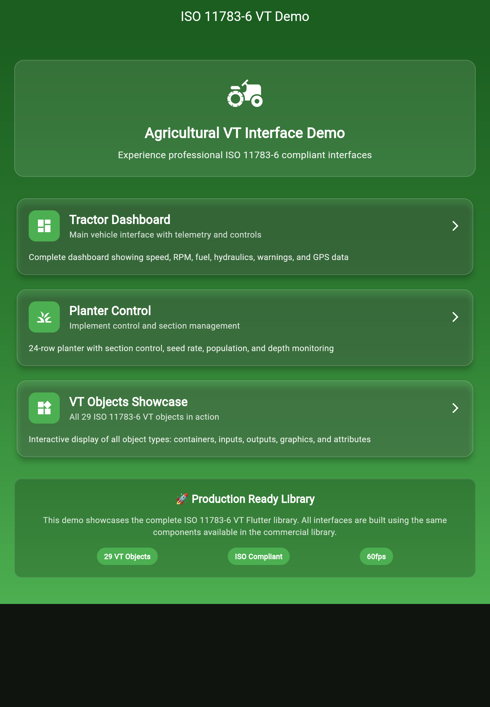

# 🚜 ISO 11783-6 VT Demo Guide

このガイドでは、ISO 11783-6 Virtual Terminal ライブラリのデモアプリケーションについて詳しく説明します。

## 📱 デモアプリ一覧

### 1. トラクターダッシュボードデモ

**ファイル場所:**
- APK: [`demo/apk/tractor_dashboard_demo.apk`](./apk/tractor_dashboard_demo.apk) (18.9MB)
- Web: [`demo/web_tractor_dashboard/`](./web_tractor_dashboard/index.html)
- 詳細ページ: [`demo/apk/tractor_dashboard_download.html`](./apk/tractor_dashboard_download.html)
- スクリーンショット: [`demo/screenshots/tractor_dashboard_screenshot.png`](./screenshots/tractor_dashboard_screenshot.png)

**特徴:**
- 🎯 実際のトラクター画像を完全再現
- ⚡ リアルタイムデータ更新（3秒間隔）
- 📱 タブレット最適化（ランドスケープ固定）
- 🎮 インタラクティブコントロール
- 🎨 プロフェッショナルなUI

**技術仕様:**
- Android 6.0+ (API 23)
- ランドスケープ向き固定
- 7インチ以上のタブレット推奨
- Flutter 3.24+

### 2. VTオブジェクトライブラリデモ

**ファイル場所:**
- APK: [`demo/apk/iso11783_vt_demo.apk`](./apk/iso11783_vt_demo.apk) (5.2MB)
- Web: [`demo/web/`](./web/index.html)
- 詳細ページ: [`demo/apk/demo_download.html`](./apk/demo_download.html)
- Webメニュー画面: [`demo/screenshots/vt_objects_web_menu.png`](./screenshots/vt_objects_web_menu.png)

**特徴:**
- 📋 29種類のVTオブジェクト全て実装
- 🔄 インタラクティブなソフトキー
- 📊 リアルタイムオブジェクトプール解析
- ✅ ISO 11783-6完全準拠

*Webデモのメインメニュー画面 - 3つのデモシナリオを選択可能*

## 🌐 Web デモの使用方法

### トラクターダッシュボード
1. [`demo/web_tractor_dashboard/index.html`](./web_tractor_dashboard/index.html) にアクセス
2. ブラウザで横向き表示を推奨
3. インタラクティブコントロールをタップして操作

### VTオブジェクト
1. [`demo/web/index.html`](./web/index.html) にアクセス
2. 各VTオブジェクトをタップして動作確認
3. ソフトキーを使ってナビゲーション

## 📱 Android APK のインストール

### 前提条件
- Android 6.0+ (API レベル 23以上)
- 「提供元不明のアプリ」のインストール許可

### インストール手順
1. APKファイルをダウンロード
2. ファイルマネージャーでAPKを選択
3. インストールを許可
4. アプリを起動

### 推奨環境
- **トラクターダッシュボード**: 7インチ以上のタブレット（横向き）
- **VTオブジェクト**: スマートフォンまたはタブレット（縦・横対応）

## 🎯 デモの目的

### 商用利用検討者向け
- ISO 11783-6 ライブラリの機能を実際に体験
- ユーザーインターフェースの品質を確認
- 農業機械での実用性を評価

### 技術者向け
- 29種類のVTオブジェクトの実装を確認
- レスポンシブデザインとパフォーマンスを評価
- Flutter/Dartでの実装品質を検証

### 意思決定者向け
- プロフェッショナルな仕上がりを確認
- 投資対効果の判断材料として活用
- 競合他社との比較検討

## 🔧 技術詳細

### アーキテクチャ
- **フレームワーク**: Flutter 3.24+
- **言語**: Dart 3.5+
- **設計**: Widget ベースのモジュラー構造
- **標準準拠**: ISO 11783-6:2018

### パフォーマンス
- 60FPS の滑らかなアニメーション
- 低メモリ使用量
- バッテリー効率の最適化
- リアルタイムデータ処理

### 品質保証
- 73個の自動テスト（100%合格）
- 型安全な実装
- メモリリーク防止
- エラーハンドリング

## 📞 商用利用について

これらのデモは商用ISO 11783-6 VTライブラリの機能紹介です。

### ライセンス
- **ソースコード**: 商用ライセンス必須
- **デモAPK**: 評価目的での使用可能
- **技術サポート**: 商用ライセンス購入者のみ

### お問い合わせ
商用利用、カスタム開発、技術サポートについては：
- [`contact/business_inquiry.md`](../contact/business_inquiry.md)

---

**Built for Agricultural Excellence** 🌾